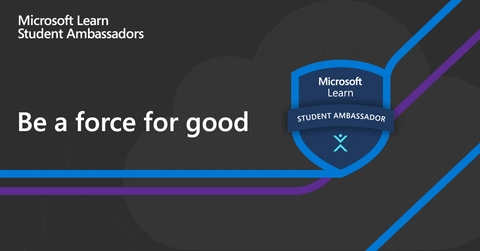

<!--

<h1 align="center">Hello | سلام | नमस्ते   I'm Mursal Furqan  </h1>  
<h3 align="center"> :heart: Data Science & Machine Learning | Microsoft Learn Student Ambassador <!-- </h3>
 

    <h2 align="center">Welcome To my <i><b> GitHub Profile </b></i></h2>

- 🔭 I’m currently working on my **Data Science** skills
- 👯 Looking to collaborate on **Open Source Projects related to Data Analysis and Visualization**
- 🤔 I’m looking for help with **mentorship for Machine Learning**
- 💬 Ask me about **Data Analysis and Visualization**
- 👩‍💻 My **skills** are 👇
<h3>Connect with me:</h3>
&nbsp;&nbsp;&nbsp;&nbsp;    &nbsp;&nbsp;&nbsp;&nbsp; &nbsp;&nbsp;&nbsp;&nbsp;    &nbsp;&nbsp;&nbsp;&nbsp; 
- 📫 Reach me at:  

 

* [Email](mailto:mursalfurqan@gmail.com)
* [Youtube](https://www.youtube.com/channel/UCpe8Kkw3fXTF0J19ZIazf_Q?view_as=subscriber)
* [Facebook](www.faceb) hhh
* [LinkedIn](https://www.linkedin.com/in/mursalfurqan/)
* [Medium](https://medium.com/@mursalfurqan)
* [Dev.to](https://dev.to/mursalfk)
* [Visit my website](mursalfurqan.com)
 
 
 

-->

<h1 align="center">Hello | سلام | नमस्ते ,</h1>  
<h1 align="center"> I'm Mursal Furqan</h1>
<h2 align="center">I am a Python Programmer (I ❤️ Python)</h2>
<h2 align="center">I am also an <b>β-Microsoft Learn Student Ambassador</b></h2>
<h3 align="center"> ❤️(Data Science && Machine Learning) <!----> </h3>

## 🧐 About

- 🌱 I’m currently learning **React and its frameworks alongwith Django(Python)**
- 📫 Want to reach me? **mursalfurqan@gmail.com** or DM me on **Twitter: https://twitter.com/mursalfurqan**
- 🔭 I am currently contributing to Open Source, building some cool daily use applications using React and Django, writing Tech Blogs on <a href = "https://mursalfk.medium.com/">Medium</a> and learning <a href="https://azure.microsoft.com/en-in/">Azure</a>  
- 👀 Things I know: <i> Python, Django, Extreme Front-End, Azure, Git/Github, GCP, </i> 
- 👐 I'm looking for: A team for Hackathons &  unlimited leaning opportunities
- 😍 I ❤️ <i>reading tech blogs, 💫travelling and building myself</i>
- 💌 💝 History 🙏 Everyone
- 😄 Pronouns: He/Him 
- 🌙 Fun fact: NASA's Perseverance Rover carries my name😁(👽 could know about me🤣) 
- 🎆 [Qwiklabs/GCloud Learning Profile](https://www.qwiklabs.com/public_profiles/e7c9d521-8506-4a4a-bc2e-c718fc91744e)
- 👩‍💻 [Microsoft Learn/Microsoft Docs Learing Profile](https://docs.microsoft.com/en-us/users/mursalfurqan/)  
  

<h3 align="left">Connect with me:</h3>

&nbsp
  &nbsp
&nbsp

&nbsp

<!-- <h3 align="left">Languages and Tools:</h3>
 -->

### Languages I have worked with -

 

 
  Visitor count 
  
 

<h4 align="center">Show some ❤️ by starring ⭐ some of the repositories!</h4>

