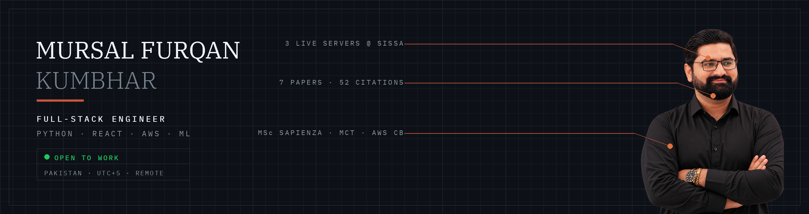
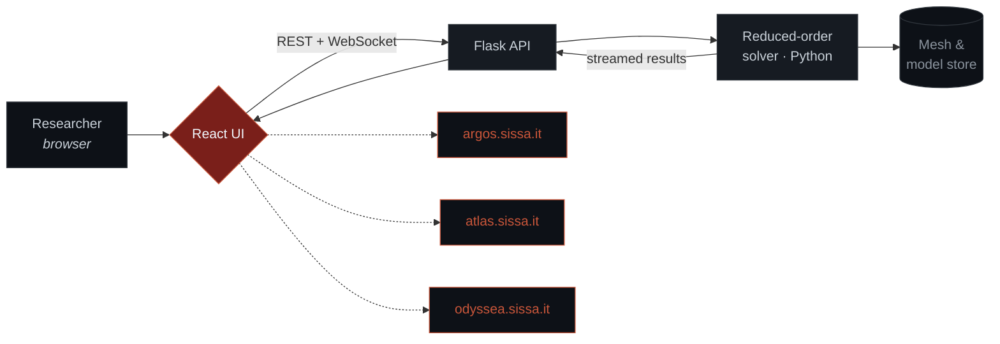

<!-- ===================================================================
     mursalfk/mursalfk/README.md

     SETUP
       1. Commit the header artwork as   assets/github-header.png
       2. Add                            .github/workflows/profile-assets.yml
       3. Add repo secret METRICS_TOKEN  (classic PAT: read:user, repo)
       4. Settings → Actions → General → Read and write permissions
       5. Run "Profile assets" once from the Actions tab

     WHY NO github-readme-stats CARDS
       Their public instance is one Vercel deployment serving millions of
       READMEs and it exhausts its rate limit most days, which is why
       those cards kept failing. Everything visual here is either native
       to GitHub (mermaid, tables, alerts) or committed to this repo by
       an Action, so nothing depends on a third party being up.
=================================================================== -->

  
  
  
  

> [!NOTE]
> **Open to full-time engineering roles** — remote or on-site, including
> US-facing shifts. Pakistan · UTC+5.
> **[Résumé and case studies →](https://mursalfk.vercel.app/hire)**

## What I actually built

At **SISSA mathLab** in Trieste I wrapped high-fidelity simulation backends in
interfaces researchers could use. Three of them are still online.

```mermaid
flowchart LR
    U["Researcher<br/><i>browser</i>"] --> R{"React UI"}
    R -->|"REST + WebSocket"| F["Flask API"]
    F --> S["Reduced-order<br/>solver · Python"]
    S --> M[("Mesh &<br/>model store")]
    S -->|"streamed results"| F
    F --> R

    R -.-> A["argos.sissa.it"]
    R -.-> B["atlas.sissa.it"]
    R -.-> C["odyssea.sissa.it"]

    style U fill:#0d1117,stroke:#30363d,color:#c9d1d9
    style R fill:#7a1f1a,stroke:#c9563a,color:#f0f6fc
    style F fill:#161b22,stroke:#30363d,color:#c9d1d9
    style S fill:#161b22,stroke:#30363d,color:#c9d1d9
    style M fill:#0d1117,stroke:#30363d,color:#8b949e
    style A fill:#0d1117,stroke:#c9563a,color:#c9563a
    style B fill:#0d1117,stroke:#c9563a,color:#c9563a
    style C fill:#0d1117,stroke:#c9563a,color:#c9563a
```

<table>
<tr><td width="55%" valign="top">

**Now** — writing on AWS security and IAM tooling · building this portfolio on
Next.js 16 · exploring Bedrock AgentCore and agent evaluation · running
AWS User Group Karachi.

**Before SISSA** — led React and React Native at Diya Interactive, shipping
QriosityNet to 1,000+ users and secure portals for two insurance providers.

</td><td width="45%" valign="top">

| | |
|---|---|
| **Papers** | 7 peer-reviewed |
| **Citations** | 52 · h-index 4 |
| **Certifications** | 54 |
| **Roles** | 12 across 3 countries |
| **Venues** | IEEE · CRC Press · Springer |

</td></tr>
</table>

---

<table>
<tr><td width="50%" valign="top">

### Selected work

**[ARGOS · ATLAS · Odyssea](https://argos.sissa.it/)** 
Production simulation servers · Python + React · SISSA

**[Pixel Alchemy Studio](https://github.com/mursalfk/Pixel-Alchemy-Studio)** 
Batch cinematic image stylisation, desktop

**[SecureEntry](https://github.com/mursalfk/secureentry_flask)** 
Face + voice dual-auth intrusion alarm

**[ASL CV GUI](https://github.com/mursalfk/asl_cv_gui)** 
Real-time ASL prediction with Mediapipe

</td><td width="50%" valign="top">

### Writing

<!-- BLOG-POST-LIST:START -->- [Your Integrity Checks Are Watching the Wrong Layer](https://dev.to/aws-builders/your-integrity-checks-are-watching-the-wrong-layer-31ii) - [Same AWS Error, Two Answers: I Built a Tool That Stops Guessing at IAM](https://dev.to/aws-builders/same-aws-error-two-answers-i-built-a-tool-that-stops-guessing-at-iam-2lf6) - [My Robot Accountant Got an Eviction Notice. So We Moved: Migrating from Bedrock Agents Classic to AgentCore](https://dev.to/aws-builders/my-robot-accountant-got-an-eviction-notice-so-we-moved-migrating-from-bedrock-agents-classic-to-4bjo) - [I Let a Bedrock Agent Watch My AWS Bill for 30 Days. Here Is Everything It Caught, Missed, and Made Up](https://dev.to/aws-builders/i-let-a-bedrock-agent-watch-my-aws-bill-for-30-days-here-is-everything-it-caught-missed-and-made-1lde) <!-- BLOG-POST-LIST:END -->

More at **[dev.to/mursalfk](https://dev.to/mursalfk)**

</td></tr>
</table>

---

### Where the time goes

<!-- Generated by .github/workflows/profile-assets.yml and committed to
     this repo, so it renders even when third-party services are down. -->

<b>Coding habits and topics</b>

 

<!-- Theme-adaptive: GitHub serves the right one automatically. -->
<picture>
  <source media="(prefers-color-scheme: dark)"  srcset="https://raw.githubusercontent.com/mursalfk/mursalfk/output/snake-dark.svg" />
  <source media="(prefers-color-scheme: light)" srcset="https://raw.githubusercontent.com/mursalfk/mursalfk/output/snake-light.svg" />
  
</picture>

fun zone

 

  

My name is on NASA's Perseverance rover.

